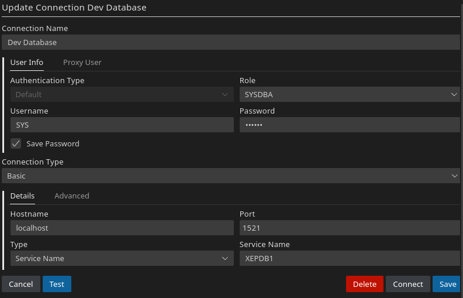

# Oracle DB Docker scripts
Depending on what OS you might need to install Docker differently. Please follow the [official docs](https://docs.docker.com/engine/install/).

# Creating a OracleDB server
**Make sure you installed Docker!**

**Windows**: Rename `start.sh` to `start.ps1`. Click to run inside of Powershell. You might need admin access for it.

**Linux**: Open a terminal inside the folder and run `sudo ./start.sh`.

**MacOS**: Execute the script with admin access. I do not own a MacOS device to test.

# Connecting to the server
Install [Visual Studio Code](https://code.visualstudio.com/). Navigate to extensions and install "Oracle SQL Developer".

After installing, you should be able to create a new connection.

The password is `parola`. Mind that the DB storage is not persistent. This is only suitable for simple testing.
